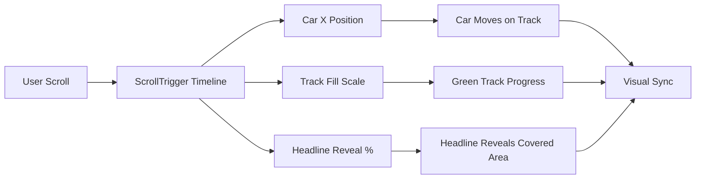

<div align="center">


<p>
  
  
  
  
</p>

<p><strong>Scroll‑scrubbed hero track with a car that reveals the headline as it moves.</strong></p>

<p>
  <a href="https://github.com/Arbab-ofc/W-E-L-C-O-M-E-I-T-Z-F-I-Z-Z">
    
  </a>
  <a href="https://arbab-ofc.github.io/W-E-L-C-O-M-E-I-T-Z-F-I-Z-Z/">
    
  </a>
</p>

</div>

---

## About

A Vite + React single‑page experience built around a bold hero animation. The car scrubs horizontally on scroll, the track fills progressively, and the headline reveals only where the car has covered. Stat cards are split above and below the track to balance the composition.

## Highlights

- Scroll‑scrubbed hero animation with GSAP ScrollTrigger
- Track fill synced with car position
- Headline text reveal masked to the fill
- Split stats layout for a premium, editorial feel
- Responsive sizing for track, headline, and car

## How It Works (Map Diagram)



## Tech Stack

- React
- Vite
- GSAP + ScrollTrigger
- CSS

## Project Structure

```
.
├─ public/
│  └─ favicon.svg
├─ src/
│  ├─ assets/
│  ├─ components/
│  ├─ styles.css
│  └─ main.jsx
├─ index.html
└─ package.json
```

## Getting Started

### Prerequisites

- Node.js 18+
- npm

### Clone

```
git clone https://github.com/Arbab-ofc/W-E-L-C-O-M-E-I-T-Z-F-I-Z-Z.git
cd W-E-L-C-O-M-E-I-T-Z-F-I-Z-Z
```

### Install

```
npm install
```

### Run (Development)

```
npm run dev
```

### Build

```
npm run build
```

### Preview

```
npm run preview
```

## Deploy (GitHub Pages)

### One‑time Setup

```
npm install --save-dev gh-pages
```

### Deploy

```
npm run build
npm run deploy
```

### GitHub Pages Settings

- Repo → Settings → Pages
- Source: `gh-pages` / `/ (root)`

## Customization

- Track and headline styles: `src/styles.css`
- Hero animation logic: `src/components/Hero.jsx`
- Car asset: `src/assets/hero-visual.png`

---

## Contact

<p>
  <a href="https://github.com/Arbab-ofc">
    
  </a>
  <a href="mailto:arbabprvt@gmail.com">
    
  </a>
  <a href="https://www.linkedin.com/in/arbab-ofc/">
    
  </a>
</p>
